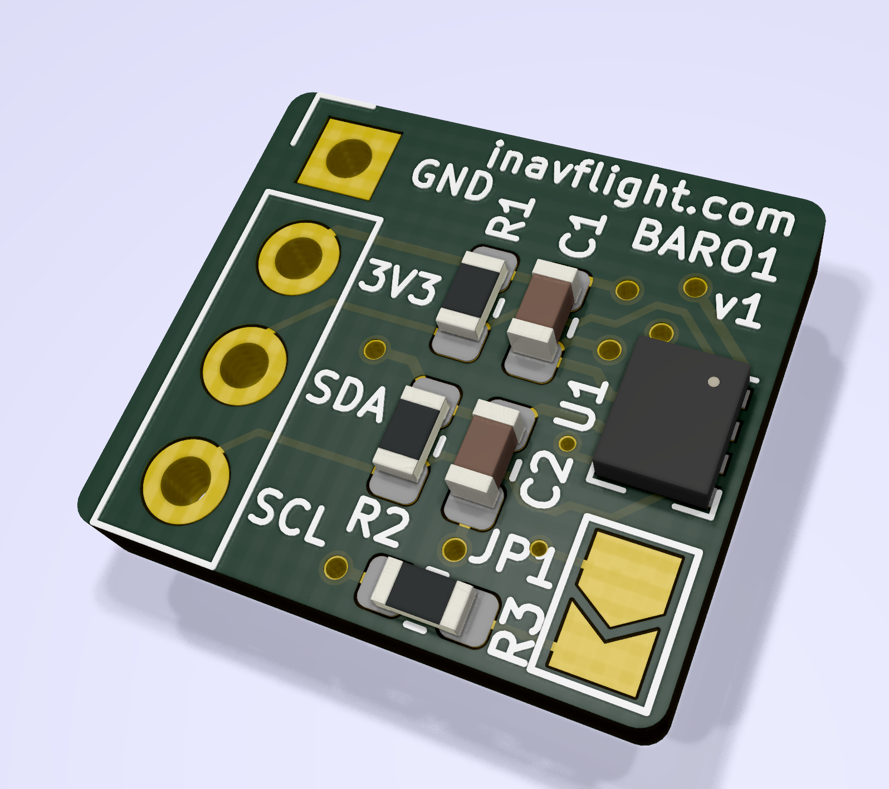
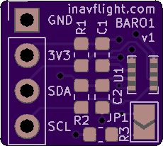
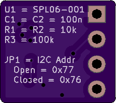

INAV BARO1
=================

Barometer board with optional pull-ups, using an SPL06.

## Bill of Materials

- 2x 0603 100n capacitor
- 1x LGA8 SPL06-001
- 2x 0603 10k resistor (optional, skip if the I2C master has adequate pull-ups)
- 1x 0603 100k resistor (optional, needed for alternative I2C addr)

## Building this project

Soldering the SPL06 with an iron can be tricky. Use hot air/reflow oven/hot plate instead. Passives are 0603, so easily doable with
just an iron.
