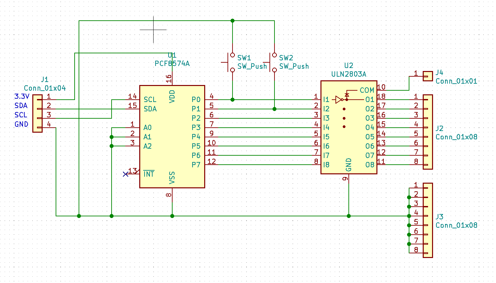
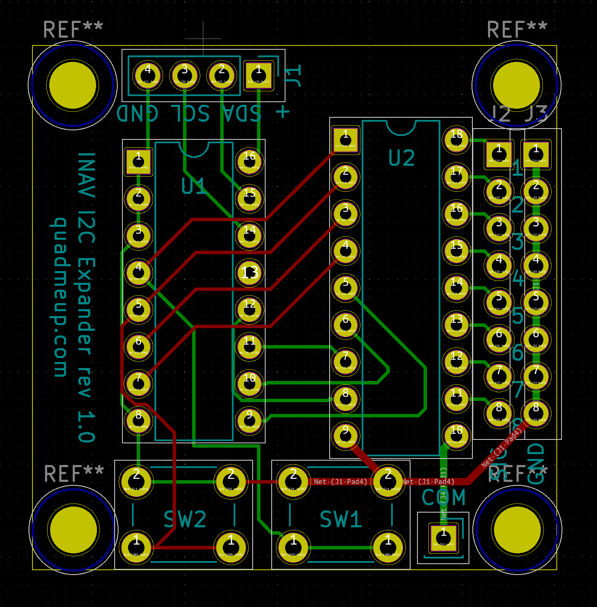
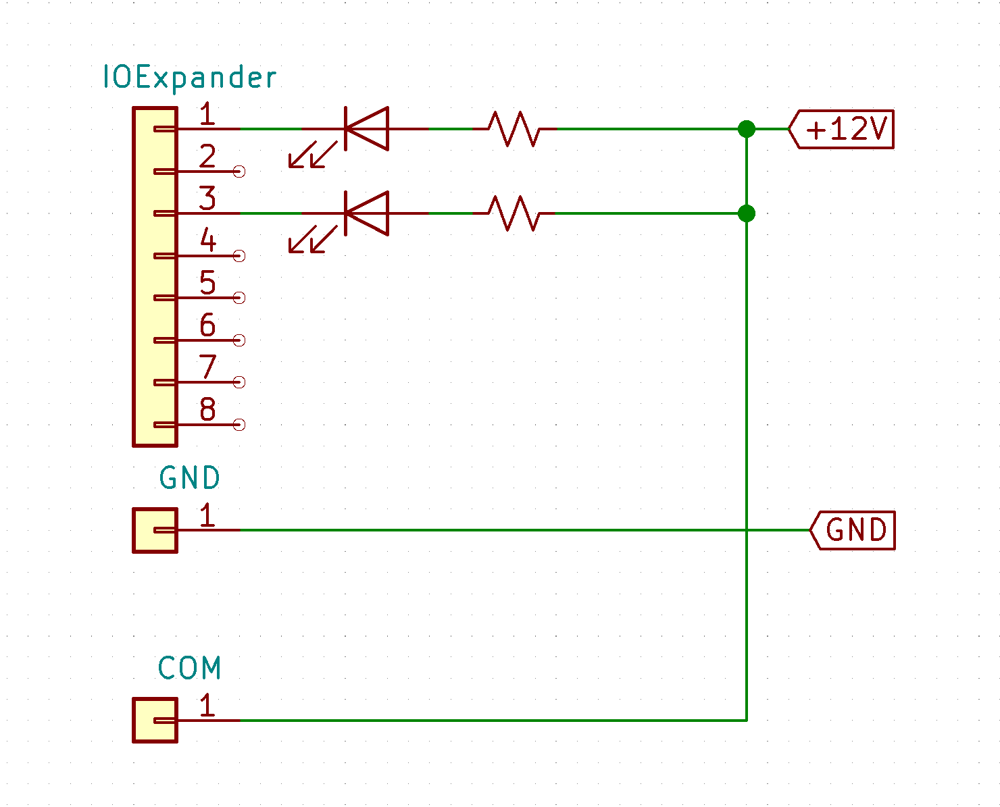

# INAV I2C IO Expander board

INAV I2C IO Expander board offers 8 digital outputs. 

* All elements are THT for easy soldering by beginners
* 36x36mm PCB with 30.5x30.5mm mounting holes fits on top of most flight controllers
* Each channel can be loaded to around 300mA on 3.3V
* Switching is done on the low side
* In case of inductive load, COM port has to be connected to the Vcc
* Max voltage ULN2803 can handle is 50V. It is 8S ready, however 12-16V is recommended
* Connects via I2C to any INAV compatible flight controller
* Supported in INAV 2.6 via Logic Conditions in Programming Framework
* Buttons are not yet supported by INAV

## Example usage

## BOM

* 1x PCF8574 THT
* 1x ULN2803A THT
* 2x Tactile button

PCB can be ordered via [OSH Park](https://oshpark.com/shared_projects/GNc1dy58)