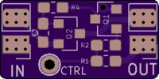
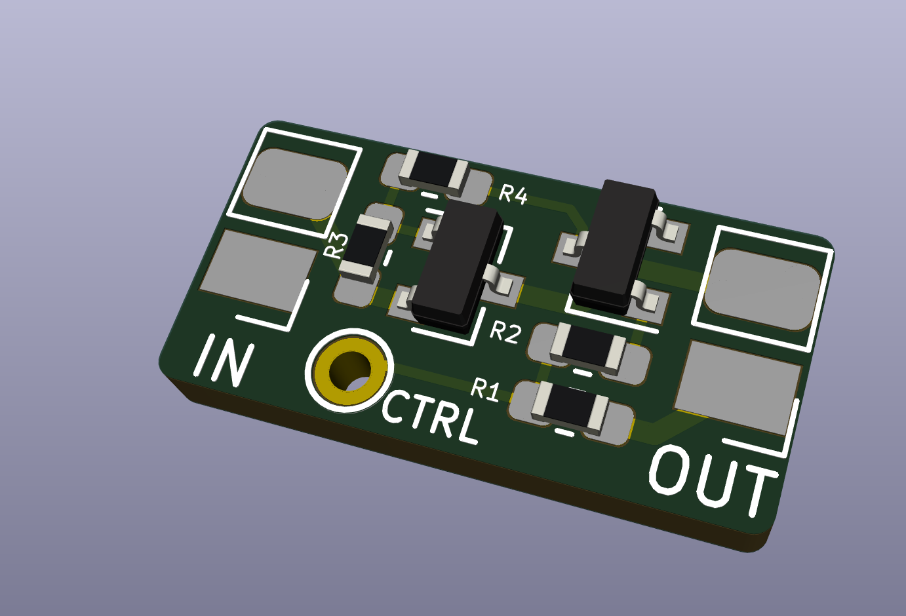

INAV Power Switch
=================

High side power switch that can be controlled by the flight
controller used PINIO.

Switching on the high side (instead of the simpler low side) is
useful for devices that must stay at exactly the same ground
potential (e.g. camera and VTX).

## Bill of Materials

- 2x 0603 6k8 resistor
- 1x 0603 47k resistor
- 1x 0603 10k resistor
- 1x SOT23 AO3400 N-Channel MOSFET
- 1x SOT23 AO3401 P-Channel MOSFET

## Building this project

All components can easily be soldered with a soldering iron,
just use 0.6mm solder and a fine tip.
